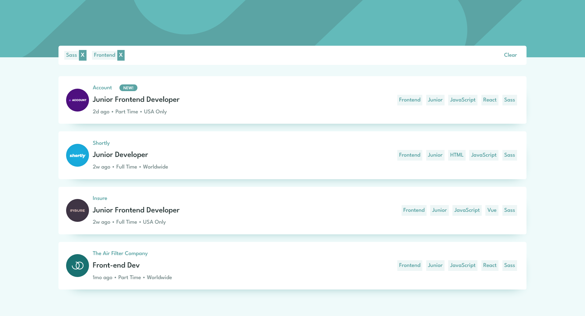

# Job listing with filtering

## Sobre
Meu objetivo pessoal com este projeto foi aprender e por em prática conhecimentos com a biblioteca React e o pré-processador SASS com a sintaxe SCSS.

Para isso utilizei este desafio do site Front-end Mentor, que foi construir esta página de listagem de empregos e deixá-la o mais próximo possível do design.
Os usuários devem ser capazes de:

- Ver o layout ideal para o site, dependendo do tamanho da tela do dispositivo
- Ver os estados de foco para todos os elementos interativos na página
- Filtrar listas de empregos com base nas categorias

## Como instalar e acessar localmente

- É preciso ter o Node.JS instalado. Ou acesse o link para download:
> https://nodejs.org/en/download

- Recomendo também o uso do Git:
> https://git-scm.com/downloads

- Crie uma pasta com um nome qualquer onde preferir. Ex: 'Projetos' na área de trabalho.

- Dentro da pasta clique com o botão direito do mouse e escolha a opção:
> 'Git Bash Here'

- Com o terminal aberto faça um clone do projeto digitando:
> git clone https://github.com/willianmassayuki/job-listing.git

- Ou faça o downloado o arquivo zip e o descompacte na pasta 'Projetos'

- Dentro da pasta do projeto onde se encontram as pastas 'src', 'public', 'node_modules' 
abra o terminal do git novamente com o botão direito do mouse vá em 'Git Bash Here' e digite o comando:
> npm install vite 

- Para rodar o projeto digite o comando:
> npm run dev

- Aperte Ctrl e clique no endereço local

## Para testar
- Passe o mouse sobre os elementos da tela para verificar os efeitos de interação;
- Redimensione o tamanho da janela do navegador para conferir a responsividade;
- Clique nas categorias à direita para adicionar termos ao filtro;
- Clique novamente no mesmo elemento, no 'X'ao lado direito dos termos na barra superior ou no botão 'Clear' para limpar o filtro;

## Tecnologias utilizadas
- React.JS (Hooks useState e useEffect, Template literals, map, Fecth API, operador ternário )
- SASS (Mixins, variáveis, nesting, importação de aquivos)
